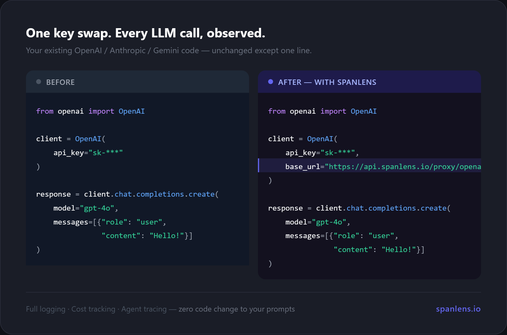
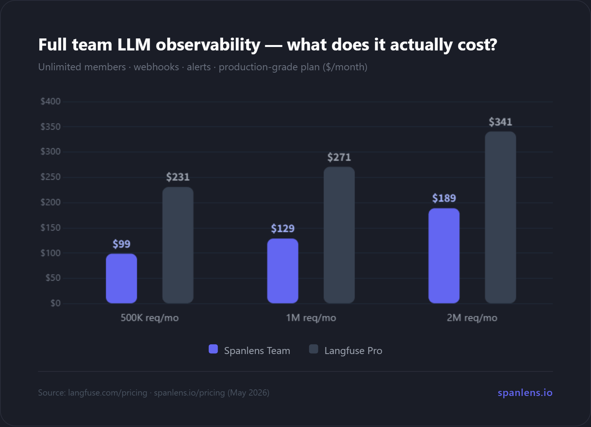
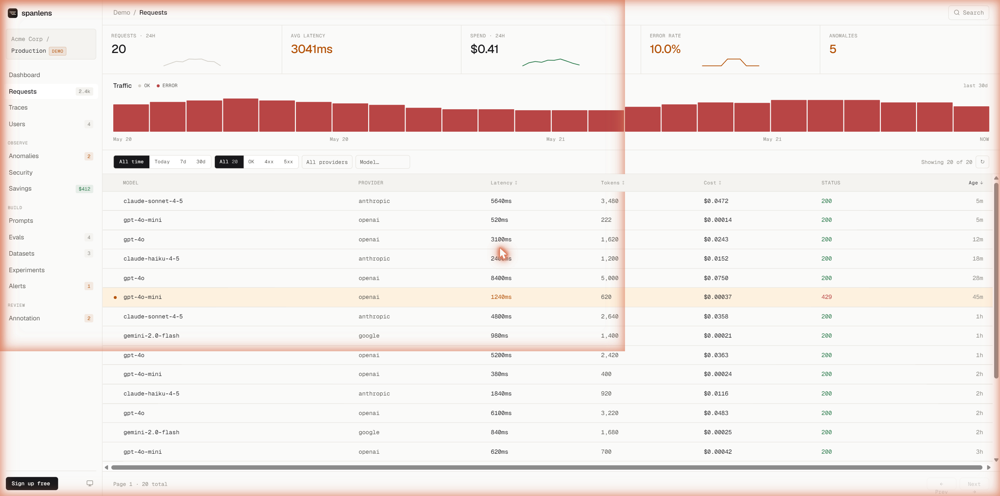
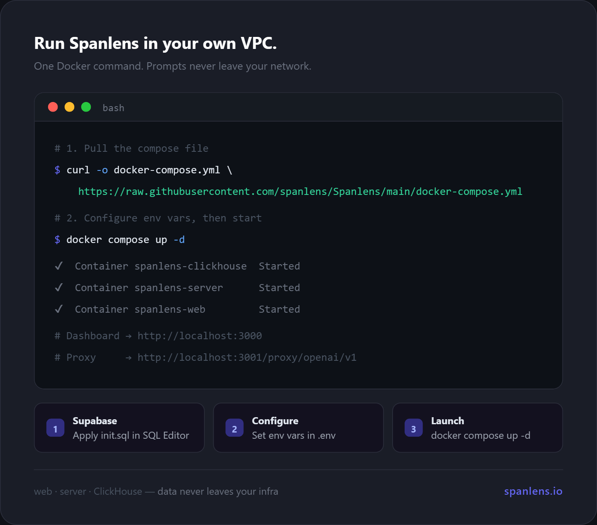

# Spanlens

[](./LICENSE)
[](https://www.npmjs.com/package/@spanlens/sdk)
[](https://pypi.org/project/spanlens/)
[](https://www.npmjs.com/package/@spanlens/sdk)

**Open-source LLM observability.** Record every OpenAI / Anthropic / Gemini call with one line of code — cost, latency, tokens, traces, anomalies, PII scan, and model-swap suggestions. Self-hostable. MIT.

> **Hosted**: [spanlens.io](https://www.spanlens.io) · **npm**: [`@spanlens/sdk`](https://www.npmjs.com/package/@spanlens/sdk) · **PyPI**: [`spanlens`](https://pypi.org/project/spanlens/) · **CLI**: [`@spanlens/cli`](https://www.npmjs.com/package/@spanlens/cli)

---



---

## Why Spanlens?

- **Helicone** was acquired and its roadmap is uncertain.
- **Langfuse** is powerful but complex to set up and expensive to scale.
- **Spanlens** ships the 20% of features that cover 80% of real production needs — request log, cost tracking, agent tracing, anomaly detection, PII scanning, prompt versioning — with a clean UI, a two-minute setup, and a price that doesn't punish growth.

| | Spanlens | Langfuse Pro | Helicone |
|---|---|---|---|
| Open source | ✅ MIT | ✅ MIT | ✅ MIT |
| Self-hostable | ✅ Docker one-liner | ✅ | ✅ |
| Free tier | 50K req/mo | 50K events/mo | 10K req/mo |
| Team plan (1M req/mo) | **$129/mo** | $271/mo | ~$200/mo |
| Agent tracing | ✅ | ✅ | ⚠️ limited |
| LLM-as-judge evals | ✅ | ✅ | ❌ |
| PII + injection scan | ✅ | ❌ | ❌ |
| Model recommendations | ✅ | ❌ | ❌ |
| Prompt A/B experiments | ✅ | ✅ | ❌ |



---

## ⚡ Quick start — 30 seconds

### TypeScript / JavaScript (Next.js)

```bash
npx @spanlens/cli init
```

The wizard:

1. Installs `@spanlens/sdk` with your package manager (npm / pnpm / yarn / bun)
2. Writes `SPANLENS_API_KEY` to `.env.local`
3. Rewrites every `new OpenAI({ apiKey, baseURL })` into `createOpenAI()`

Paste your Spanlens API key once, confirm two prompts, done. Your LLM calls are now flowing through the Spanlens proxy — visible in [www.spanlens.io/requests](https://www.spanlens.io/requests).

#### Manual TypeScript setup

```ts
import { createOpenAI } from '@spanlens/sdk/openai'
const openai = createOpenAI()  // reads SPANLENS_API_KEY, uses Spanlens proxy baseURL
```

### Python

```bash
pip install "spanlens[openai]"
```

```python
from spanlens.integrations.openai import create_openai

client = create_openai()  # reads SPANLENS_API_KEY from env
res = client.chat.completions.create(
    model="gpt-4o-mini",
    messages=[{"role": "user", "content": "Hello"}],
)
```

For agent tracing in Python (multi-step, async, tool calls) see the [Python SDK README](./packages/sdk-python/README.md).

---

## What you see



Every request — model, provider, latency, tokens, cost, full prompt + response body. Filter, search, export. Streaming responses reconstructed automatically.

---

## What you get

| Feature | Description |
|---|---|
| **Request log** | Every LLM call — model, tokens, cost, latency, request/response body (streaming responses reconstructed too) |
| **Agent tracing** | Multi-step workflows as Gantt/waterfall span trees |
| **Cost tracking** | Per-request cost breakdown with prompt-cache pricing (Anthropic / OpenAI cache hits billed at their reduced rate), daily rollups, budget alerts |
| **Per-end-user analytics** | Tag calls with `x-spanlens-user` (SDK: `withUser()` / `with_user()`) → /users page shows per-user cost, tokens, errors, models, last seen |
| **Anomaly detection** | 3σ deviations in latency, cost, or error rate vs. your 7-day baseline — with root-cause hints (token delta, HTTP status breakdown) |
| **PII + prompt-injection scan** | Regex-based detection on request **and response** bodies; optional per-project blocking (422) for injections; instant alert emails to workspace owner |
| **Model recommendations** | "Your gpt-4o calls look like classification — try gpt-4o-mini" with estimated monthly savings |
| **Prompt versioning + A/B** | Register prompt templates, run traffic-split experiments, compare versions side by side (latency / cost / error rate) |
| **Prompts Playground** | Execute any prompt version with variable injection directly in the dashboard — see real cost and response before shipping |
| **Evals & Experiments** | Build LLM-as-judge evaluators, create datasets, and run A/B experiments comparing two prompt versions; human annotation queue also included |
| **Saved filters** | Pin frequently used request-log queries (model, status, cost range, tags) and share them across the workspace |
| **Outbound webhooks** | Subscribe to `request.created` / `trace.completed` / `alert.triggered` events. Payloads are HMAC-signed via `X-Spanlens-Signature: sha256=…` so receivers can verify origin |
| **OpenTelemetry / OTLP ingest** | `POST /v1/traces` accepts OTLP/HTTP JSON exports using the `gen_ai.*` semantic conventions — drop in any OTel SDK without writing Spanlens-specific code |
| **Provider-key security** | Weekly digest emails for stale (unused 90d+) provider keys + daily GitGuardian leak scan against your active keys, with per-key scan history |
| **Privacy controls** | Per-request `x-spanlens-log-body: full \| meta \| none` header lets customers shrink what Spanlens stores (drop bodies, drop end-user IDs) without dropping the request itself |
| **Data export** | Download request logs as CSV or JSON (`GET /api/v1/exports/requests?format=csv`) for offline analysis or BI tooling. Separate security export for flagged (PII / injection) calls |

---

## Team & workspaces

Spanlens is multi-user out of the box — invite teammates, hand out roles,
spin up a separate workspace per client.

- **Roles** — `admin` (members + billing), `editor` (data + settings), `viewer`
  (read-only). Last admin is protected against demotion / removal.
- **Email invitations** — 7-day expiry, sha256-hashed tokens. Sent via
  [Resend](https://resend.com) when `RESEND_API_KEY` is set; falls back to
  console-logging the accept URL for local dev.
- **Pending-invitation banner** — surfaces unaccepted invites at the top of
  the dashboard, even if the recipient never opened the email. Accept joins
  + auto-switches active workspace; Decline removes the row.
- **Multi-workspace** — switch between workspaces from the sidebar
  (`sb-ws` cookie + hard reload so middleware re-resolves scope). Useful
  for consultants juggling multiple clients or one team running prod /
  staging as separate workspaces.
- **Two-step onboarding** — new signups land on `/onboarding`: name your
  workspace, answer two optional survey questions, done. Invitees get a
  short-circuited variant where Accept skips workspace creation entirely.
- **Audit log** — Settings → Audit log records every membership / role /
  invitation event with actor + timestamp.

---

## Monorepo structure

```
Spanlens/
├── apps/
│   ├── web/             — Next.js 14 dashboard (www.spanlens.io)
│   └── server/          — Hono LLM proxy + REST API (spanlens-server.vercel.app)
├── packages/
│   ├── sdk/             — @spanlens/sdk:  TypeScript / JavaScript SDK
│   ├── sdk-python/      — spanlens (PyPI): Python SDK
│   └── cli/             — @spanlens/cli:  npx wizard for 1-command setup
├── clickhouse/
│   ├── migrations/      — ClickHouse schema for the `requests` log table
│   └── apply.ts         — `pnpm ch:migrate` runner (idempotent)
└── supabase/
    ├── migrations/      — Postgres schema (orgs, projects, keys, prompts, … — RLS-gated)
    └── seeds/           — model_prices.sql etc.
```

### Storage split

Spanlens uses **two databases**, each for what it's good at:

- **Supabase (Postgres)** — transactional, relational, RLS-gated data: organizations, projects, members, API + provider keys, prompts, datasets, alerts, billing, audit log.
- **ClickHouse** — the high-volume append-only `requests` table (every LLM call). All reads go through [`apps/server/src/lib/requests-query.ts`](./apps/server/src/lib/requests-query.ts), which auto-injects the `organization_id` filter and the per-plan retention window (free=14d / pro=90d / team=365d). If ClickHouse is briefly unreachable, the proxy falls back to a Supabase queue (`requests_fallback`) that a cron replays every 5 minutes — no log loss.

### Projects, unified keys, and headers

- A workspace can hold **multiple projects** (e.g. `dev` / `staging` / `prod`, or one per app). Each project gets its own quota slice, provider keys, and prompt namespace.
- **Unified API keys** — one `sl_live_*` key per project is provider-agnostic. Spanlens infers the provider from the request path (`/proxy/openai/*` vs `/proxy/anthropic/*` vs `/proxy/gemini/*`), so you only need one Spanlens key even if you call multiple model vendors.
- **`X-Spanlens-*` headers** (set automatically by the SDK helpers `withUser()`, `withSession()`, `withPromptVersion()`, `withLogBody()`): tag a request with end-user / session IDs, link it to a prompt-version experiment, or limit how much body Spanlens stores. Full list in [`/docs/proxy`](https://www.spanlens.io/docs/proxy).
- **Streaming safety** — proxy responses are gracefully closed at 290s with a `truncated=true` flag in the log, so long streams never silently disappear.

---

## Local development

Prerequisites: Node 20+, pnpm 10.33.0+, Docker (for local Supabase), [Vercel CLI](https://vercel.com/docs/cli) optional.

```bash
# 1. Clone + install
git clone https://github.com/spanlens/Spanlens.git
cd Spanlens
pnpm install

# 2. Start local Supabase + ClickHouse (both require Docker)
supabase start
supabase db push        # apply Postgres migrations
supabase gen types --lang typescript --local > supabase/types.ts

docker compose up -d clickhouse   # start ClickHouse only (web/server run from pnpm dev)
pnpm ch:migrate                   # apply ClickHouse migrations

# 3. Env vars — see apps/server/.env.example
cp apps/server/.env.example apps/server/.env

# 4. Run everything (web on :3000, server on :3001)
pnpm dev
```

### Running tests + lint

```bash
pnpm typecheck          # TS across all packages
pnpm lint               # ESLint
pnpm test               # Vitest — server + sdk + cli suites
pnpm build              # production build smoke test
```

See [CLAUDE.md](./CLAUDE.md) for architecture rules and Known Gotchas (streaming, RLS, Paddle billing, Vercel Edge runtime, npm publish).

---

## Self-hosting

The easiest way to self-host is with the included `docker-compose.yml` — it runs the **dashboard (web)**, the **proxy/API server**, and a local **ClickHouse** instance together using pre-built images from GHCR.



### 1. Apply the Supabase schema (one-time)

Open your Supabase project → **SQL Editor → New query**, paste the contents of [`supabase/init.sql`](./supabase/init.sql), and click **Run**. That's it — no CLI needed.

> **Alternative (psql):**
> ```bash
> psql "postgresql://postgres:<password>@db.<ref>.supabase.co:5432/postgres" \
>   -f supabase/init.sql
> ```

### 2. Create a `.env` file

```bash
# Supabase (cloud or self-hosted)
NEXT_PUBLIC_SUPABASE_URL=https://xxxx.supabase.co
NEXT_PUBLIC_SUPABASE_ANON_KEY=eyJ...
SUPABASE_URL=https://xxxx.supabase.co
SUPABASE_ANON_KEY=eyJ...
SUPABASE_SERVICE_ROLE_KEY=eyJ...

# Encryption key — generate with: openssl rand -base64 32
ENCRYPTION_KEY=<32-byte base64>

# Random secret for cron endpoint
CRON_SECRET=<random string>

# ClickHouse (request logs — required)
CLICKHOUSE_URL=http://clickhouse:8123        # the in-network service from docker-compose
CLICKHOUSE_USER=spanlens
CLICKHOUSE_PASSWORD=<choose a strong password>
CLICKHOUSE_DB=spanlens

# Optional — for invite emails
# WEB_URL=https://your-domain.com
# RESEND_API_KEY=re_...
# RESEND_FROM=Spanlens <no-reply@your-domain.com>

# Optional — Paddle billing (only if you sell paid plans on your instance)
# PADDLE_API_KEY=...
# PADDLE_NOTIFICATION_SECRET=...
# PADDLE_ENVIRONMENT=sandbox  # or production
```

### 3. Start

```bash
docker compose up -d
pnpm ch:migrate                # one-time: apply ClickHouse schema (requests table)
```

- Dashboard: `http://localhost:3000`
- API / proxy: `http://localhost:3001`
- ClickHouse HTTP: `http://localhost:8123`
- Health: `GET /health` (liveness) and `GET /health/deep` (ClickHouse + fallback queue depth)

The web container passes `NEXT_PUBLIC_*` vars as **build arguments** (Next.js bakes them into the client bundle), so they must be present before `docker compose build`.

### Server-only (no dashboard)

If you only need the proxy/API and run the dashboard separately:

```bash
docker pull ghcr.io/spanlens/spanlens-server:latest
docker run -p 3001:3001 \
  -e SUPABASE_URL=... \
  -e SUPABASE_ANON_KEY=... \
  -e SUPABASE_SERVICE_ROLE_KEY=... \
  -e ENCRYPTION_KEY=... \
  ghcr.io/spanlens/spanlens-server:latest
```

### Point your SDK at your self-hosted URL

```ts
const openai = createOpenAI({
  baseURL: 'https://your-spanlens.example.com/proxy/openai/v1',
})
```

Your Spanlens instance talks to your Supabase + ClickHouse — we never see your data.

### Background jobs (Vercel Cron / your scheduler)

The hosted instance ships with the following cron tasks (see [`apps/server/vercel.json`](./apps/server/vercel.json)). On self-host, point any scheduler at the same paths with the `CRON_SECRET` bearer:

| Path | Schedule | Purpose |
|---|---|---|
| `/cron/evaluate-alerts` | every 15m | Evaluate threshold + anomaly alerts, fire notifications |
| `/cron/snapshot-anomalies` | daily 01:00 | Materialize daily anomaly baselines |
| `/cron/replay-fallback` | every 5m | Replay `requests_fallback` queue into ClickHouse |
| `/cron/stale-key-reminders` | weekly Mon 09:00 | Email digest of idle provider keys |
| `/cron/leak-detect-keys` | daily 04:00 | GitGuardian scan of active provider keys |
| `/cron/recommend-savings-alerts` | daily 09:00 | Email model-swap savings opportunities |
| `/cron/check-past-due-downgrades` | daily 10:00 | D-3 / D-1 warnings + auto-downgrade past-due subs |

---

## Contributing

PRs and issues welcome. See [CONTRIBUTING.md](./CONTRIBUTING.md) for the
project layout, local-dev setup, coding conventions, and what we look for
in a PR. Commit messages follow [Conventional Commits](./.github/COMMIT_CONVENTION.md)
and the PR template walks through the safety checklist.

Security issues: please email `support@spanlens.io` instead of opening a
public issue. See [SECURITY.md](./SECURITY.md).

## License

[MIT](./LICENSE) — use, fork, self-host, or build on top freely. The hosted service at [spanlens.io](https://www.spanlens.io) is the recommended way to run Spanlens, but you can always pull the Docker image and run it yourself (see [docs/self-host](https://www.spanlens.io/docs/self-host)).
